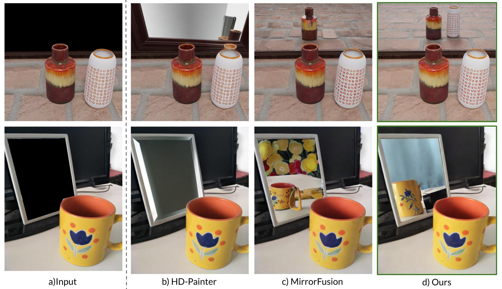

<div align="center">

<h1>MirrorVerse: Pushing Diffusion Models to Realistically Reflect the World</h1>
<h1>CVPR 2025</h1>

<p align="center">
    <a href="https://www.linkedin.com/in/ankit-dhiman-46109a174/" target="_blank"><strong>Ankit Dhiman</strong></a> <sup>1,2<b>*</b></sup>
    ·
    <a href="https://cs-mshah.github.io/" target="_blank"><strong>Manan Shah</strong></a> <sup>1<b>*</b></sup>
    ·
    <a href="https://cds.iisc.ac.in/faculty/venky/" target="_blank"><strong>R Venkatesh Babu</strong></a> <sup>1</sup>
</p>

<p align="center">
    <sup><b>*</b></sup> Equal Contribution <br>
    <sup>1</sup> Vision and AI Lab, IISc Bangalore <br>
    <sup>2</sup> Samsung R & D Institute India - Bangalore
</p>

<a href="https://arxiv.org/abs/2504.15397">
</a>
<a href="https://mirror-verse.github.io/">
</a>
<a href="ttps://mirror-verse.github.io/">
</a>
<a href="https://github.com/val-iisc/Reflecting-Reality">
</a>

<br>


</div>

---

## 🧠 Overview

**MirrorVerse** builds upon our prior work *Reflecting Reality*, pushing the frontier of mirror reflection generation by adding diversity in the synthetic dataset creation pipeline and leveraging curriculum learning for generalizing to real-world scenes.

We introduce **SynMirrorV2**, a large-scale synthetic dataset containing **207K** samples with full scene geometry, including depth maps, normal maps, and segmentation masks. **SynMirrorV2** has high-fidelity training samples featuring variable object poses, occlusions, and multi-object setups.


---

## 🚀 Highlights

- 📦 **SynMirrorV2 Dataset**: 207K synthetic samples with diverse object configurations and camera poses.
- 🧩 **Curriculum Learning Strategy**: a curriculum learning strategy that progressively adapts to complex scenarios, enabling state-of-the-art model to generalize better to real-world reflections.
- 🖼️ **Multi-object Reflection Generation**: First approach to effectively handle complex multi-object mirror scenes.
- 📊 **Robust Benchmarks**: Demonstrates strong quantitative and qualitative gains over previous SOTA.

---

## 🗓️ TODO

- [] Release the SynMirrorV2 Dataset
- [] Release pre-trained checkpoints
- [] Release codebase for training and evaluation
- [] Add interactive notebook demo for inference

---

## 🤝🏼 Citation
```
@inproceedings{dhiman2025mirrorverse,
  title={MirrorVerse: Pushing Diffusion Models to Realistically Reflect the World},
  author={Dhiman, Ankit and Shah, Manan and Babu, R Venkatesh},
  booktitle={Proceedings of the Computer Vision and Pattern Recognition Conference},
  pages={11239--11249},
  year={2025}
}
```

## 💖 Acknowledgements

This work builds on the foundation of [Reflecting Reality](https://github.com/val-iisc/Reflecting-Reality). We also thank the developers of [BlenderProc](https://github.com/DLR-RM/BlenderProc), [diffusers](https://github.com/huggingface/diffusers), and [SAM](https://github.com/facebookresearch/segment-anything) for their amazing tools and libraries.
